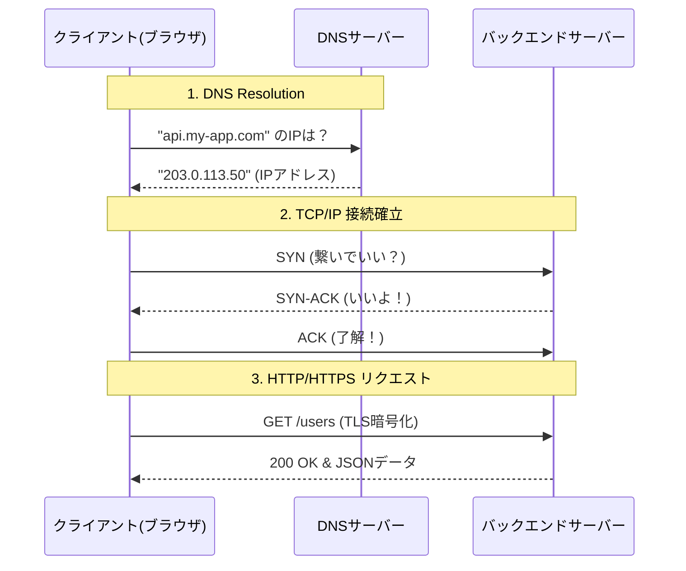

# 13.1.1: Web Basics (HTTP/HTTPS, TCP/IP, DNS)

### 1. 【エンジニアの定義】Professional Definition

> **1. HTTP/HTTPS**:
> クライアント（ブラウザ）とサーバー間でHTMLなどのデータを送受信するための通信プロトコル。HTTPSはTLS（Transport Layer Security）を用いて暗号化されており、改ざんや盗聴を防ぐ。
> 
> **2. TCP/IP**:
> インターネットの通信インフラを構成する基本プロトコル体系。IPが「目的地へのルート構築」を担い、TCPが「データの到着と順序の保証（信頼性）」を担保する。
> 
> **3. DNS (Domain Name System)**:
> 「google.com」のような人間が読めるドメイン名を、「142.250.190.46」といった機械が通信するためのIPアドレスに変換（名前解決）するシステム。インターネットの電話帳。

---

### 2. 【0ベース・深掘り解説】Gap Filling
※バックエンドエンジニアとしてシステムを設計するとき、ネットワークの基礎はトラブルシューティングの命綱になります。

#### 🌐 インターネットの裏側で何が起きているか？
APIサーバーを立ち上げ、ユーザーがそこにアクセスするとき、見えないところで3つのプロトコルがリレーしています。
*   **DNSが道案内をする**: ユーザーがURLを叩くと、まずDNSに「このAPIのIPアドレスは何？」と尋ねます。ここでDNSの設定（AレコードやCNAME）が間違っていると、どんなに良いコードを書いても一切アクセスが来ません。
*   **TCPが道をつくりデータを運ぶ**: IPアドレスがわかると、サーバーに対して「3ウェイ・ハンドシェイク（SYN -> SYN-ACK -> ACK）」を行い、信頼できる通信経路を確立します。
*   **HTTPSが注文書を暗号化して渡す**: 道ができたところで、ついに「このデータをください（GET）」というHTTPリクエストが暗号化された状態で送られます。

#### 💡 なぜこれを学ぶのか？
サーバーで「接続が切れる（Connection Timeout）」というエラーが出たとき、HTTPのレイヤー（アプリのエラー）なのか、TCPのレイヤー（NW機器による遮断）なのか、DNSのレイヤー（名前が引けない）なのかを切り分ける力が必要だからです。

---

### 3. 【通信の視覚化】Visual Guide

ブラウザからあなたのバックエンドAPIに到達するまでの流れです。

---

### 💡 この用語のまとめ (Key Takeaways)
*   **HTTP/HTTPS**: アプリケーション同士の「会話のルール」。暗号化(S)は現代の必須条件。
*   **TCP/IP**: 荷物を確実に届けるための「配送ネットワークと書留郵便」。
*   **DNS**: 名前から住所（IP）を引く「電話帳」。設定ミスはシステム全体のダウンに直結する。
