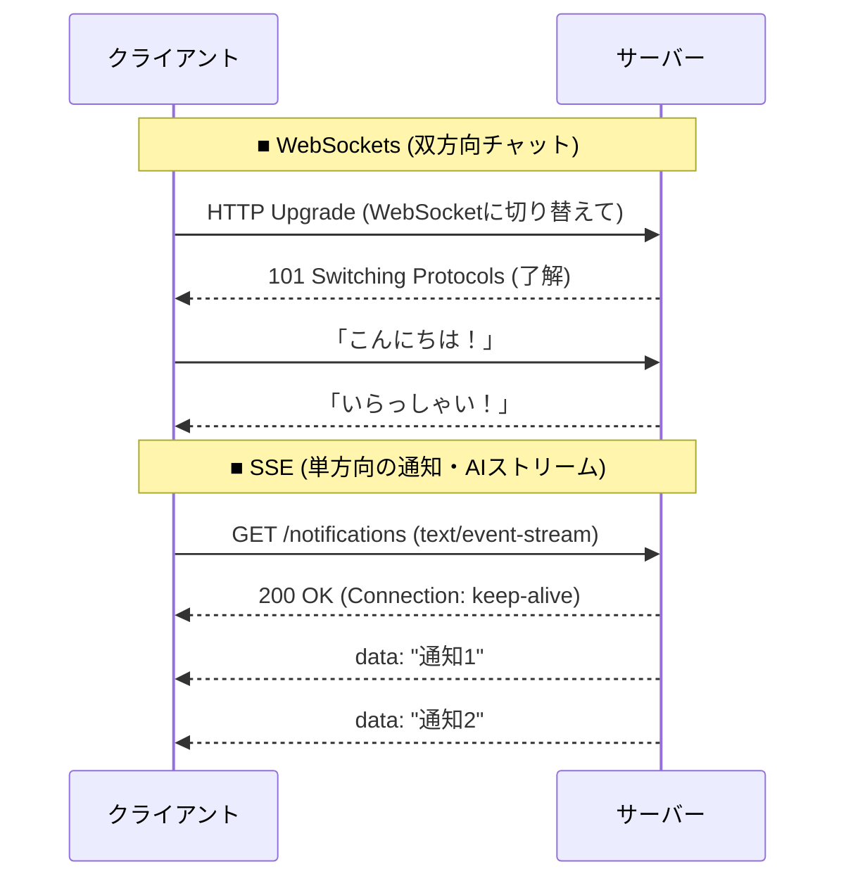

# 13.1.2: Real-time Transmits (WebSockets, SSE)

### 1. 【エンジニアの定義】Professional Definition

> **14. WebSockets**:
> 1つのTCPコネクション上で、プレーンテキストやバイナリデータを**双方向**（サーバー⇔クライアント）に低遅延で通信し続けるプロトコル。HTTPのハンドシェイク後にアップグレードして通信を確立する。
> 
> **15. Server-Sent Events (SSE)**:
> サーバーからクライアントへ**単方向**でイベントデータをリアルタイムにプッシュ送信するためのHTTP標準規格。テキストデータの送信に特化している。

---

### 2. 【0ベース・深掘り解説】Gap Filling
※従来のHTTPは「クライアントからリクエストして、サーバーが返す」という一問一答形式です。しかし、チャットや株価のリアルタイム更新ではこのルールが限界を迎えます。

#### 🔄 ポーリングの限界と双方向通信
昔は、クライアントが数秒おきに「新しいメッセージある？」と尋ねる（ポーリング）方式を取っていました。これではサーバーに無駄な負荷がかかります。
*   **WebSocketsの登場**: 電話のように「一度繋いだら、お互い好きなタイミングでしゃべれる」仕組みです。チャットアプリや、対戦型のオンラインゲームなど、リアルタイムな双方向のやり取りが必須な場面で使われます。
*   **SSEの台頭**: WebSocketsは強力ですが、常時接続の維持管理（コネクション数やLBの制約）が面倒です。そこで、「サーバーからだけ一方的に送れればいい（例：通知システム、スポーツの速報、AIのストリーミング応答など）」場合、通常のHTTP上で動く軽量なSSEが適しています。

---

### 3. 【通信の視覚化】Visual Guide

HTTP(ポーリング) vs WebSockets vs SSE のアーキテクチャ比較。

---

### 💡 この用語のまとめ (Key Takeaways)
*   **WebSockets**: 双方向。チャットやゲームなど、リアルタイムなやり取りが必要な場合に最適。
*   **SSE (Server-Sent Events)**: 単方向（サーバー→クライアント）。通知や、ChatGPTの文字ストリーミング描画などに最適で実装が楽。
