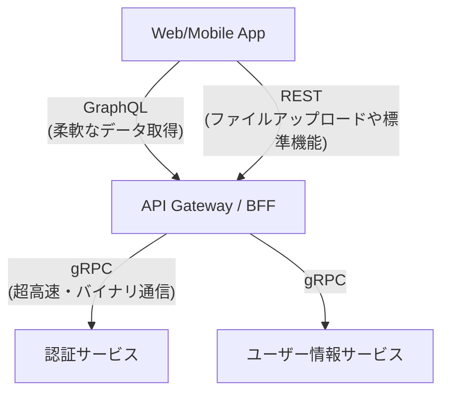

# 13.2.1: API Paradigms (REST, GraphQL, gRPC, API Design)

### 1. 【エンジニアの定義】Professional Definition

> **4. REST APIs**:
> URLでリソース（名詞）を指定し、HTTPメソッド（GET, POST, PUT, DELETE）で操作（動詞）する設計原則。「/users/123」のような直感的な設計。
> 
> **5. GraphQL**:
> Facebookが開発したAPIクエリ言語。クライアントが「欲しいデータの構造」をJSON形式でリクエストし、過不足なくデータを1つのエンドポイント(`/graphql`)から取得できる。
> 
> **6. gRPC**:
> Googleが開発したRPC（Remote Procedure Call）。Protocol Buffersを用いてデータをバイナリシリアライズし、HTTP/2のストリームで超高速に通信する。主にマイクロサービス間の内部通信で使用。
> 
> **7. API Design**:
> 適切なバージョン管理（`/v1/`）、ページネーション、一貫したエラーレスポンス構造など、開発者が使いやすいAPIを設計するための原則とベストプラクティス。

---

### 2. 【0ベース・深掘り解説】Gap Filling

#### 🆚 3大パラダイムの使い分け戦略
「とりあえずRESTで作る」時代は終わり、用途に合わせてアーキテクチャを選ぶ必要があります。
*   **RESTの限界**: 画面Aでは「ユーザーの名前だけ」欲しいのに、画面Bでは「名前と会社名と所属リスト」が欲しい場合、RESTだと`/users/1`と`/users/1/companies`の2回通信するか、重いデータを1回で全部返すしかありませんでした（オーバーフェッチ・アンダーフェッチ問題）。
*   **GraphQLの解決策**: クライアント側で「名前と会社名だけください」とクエリを書けるため、モバイルアプリのように通信回数やデータ量を削りたいフロントエンド向けAPIで大活躍します。
*   **gRPCの闘技場**: ユーザーから見える表側のAPIではなく、バックエンド同士（決済サービス ⇔ 在庫サービス）が高速にやり取りする「裏側の通信」で猛威を振るいます。バイナリデータとHTTP/2により、RESTの10倍高速と言われます。

---

### 3. 【通信の視覚化】Visual Guide

適材適所でパラダイムを組み合わせる現代のアーキテクチャ。

---

### 💡 この用語のまとめ (Key Takeaways)
*   **REST**: 業界標準。シンプルでキャッシュしやすく、外部公開APIの王道。
*   **GraphQL**: 柔軟。フロントエンド（スマホアプリなど）の通信最適化に特化。
*   **gRPC**: 超高速。マイクロサービス内部のバックエンド間通信のデファクトスタンダード。
*   **API Design**: 使い勝手を決める「プロダクトの顔」。ドキュメントと一貫性が命。
