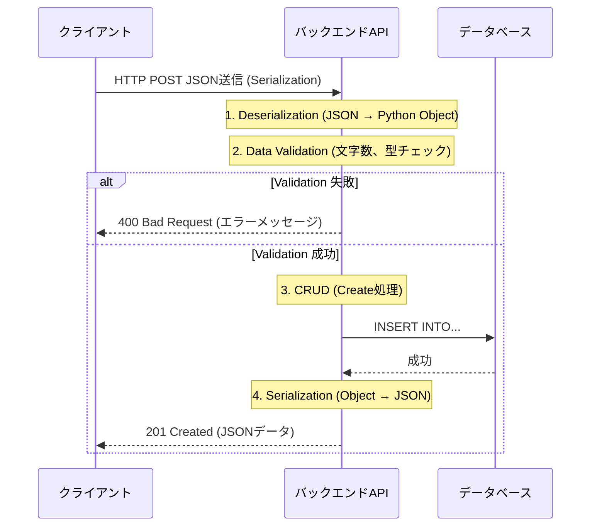

# 13.2.2: Data Handling (CRUD, Valid, SerDe)

### 1. 【エンジニアの定義】Professional Definition

> **8. CRUD Operations**:
> データ操作の基本4原則。Create (作成=POST), Read (読み取り=GET), Update (更新=PUT/PATCH), Delete (削除=DELETE)。大半のWebAPIはこの4つの操作にマッピングされる。
> 
> **41. Data Validation**:
> クライアントから送信されたデータが、要求する型、長さ、形式（メールアドレスなど）、ビジネスルールに合致しているかをサーバー側で検証すること。
> 
> **42. Serialization / 43. Deserialization**:
> 【シリアライズ】メモリ上のオブジェクトや構造体を、ネットワーク転送や保存可能なバイト列（JSON、XML、文字列）に変換すること。
> 【デシリアライズ】受信したバイト列を、アプリケーションで扱える元のオブジェクト構造に復元すること。

---

### 2. 【0ベース・深掘り解説】Gap Filling

#### 🛡️ なぜバリデーションが最も重要か？
「フロントエンド（HTML/JS）で入力チェックしているから、サーバー側ではチェックしなくていいよね？」は**初心者エンジニアが陥る最大の罠**です。
*   **セキュリティの壁**: 悪意のあるユーザーは、PostmanやcURLを使ってフロントエンドをバイパスし、直接APIに異常なデータを送り込んできます。バックエンドでのData Validationは「最後の砦」であり、ここを突破されるとSQLインジェクションやシステムクラッシュに直結します。
*   **早期リターン**: データベースの処理をする「前」に弾くことで、無駄なリソース消費を防ぎます。

#### 📦 データの箱詰め（SerDe）
プログラム言語（Pythonの辞書、Javaのクラス）の中身は、そのままではネットワークの線を通りません。
「段ボール（JSON）」にテキストとして綺麗に詰める作業が Serialization（シリアライズ）です。受け取った側で段ボールを開けて、自分の言語のクラスに組み立て直すのが Deserialization（デシリアライズ）です。ここで型エラーなどがよく発生します。

---

### 3. 【通信の視覚化】Visual Guide

データがリクエストされてからDBに保存されるまでのライフサイクル。

---

### 💡 この用語のまとめ (Key Takeaways)
*   **CRUD**: データ操作の基本。REST APIの設計と完全にリンクする。
*   **Data Validation**: バックエンドにおける絶対の防衛線。フロントのバリデーションは「ユーザー体験」のため、バックエンドのバリデーションは「セキュリティと一貫性」のため。
*   **SerDe**: 言語の壁を超えて通信するための「翻訳と箱詰め」作業。
