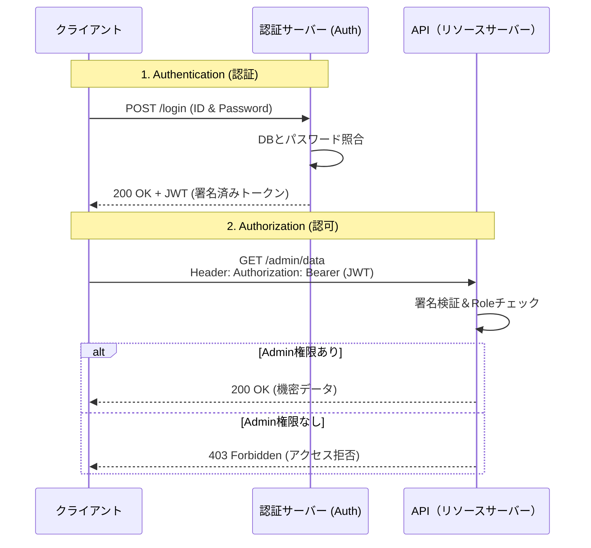

# 13.3.1: Identity Management (AuthN, AuthZ, JWT, OAuth)

### 1. 【エンジニアの定義】Professional Definition

> **9. Authentication (AuthN - 認証)**:
> 「あなたは誰か（Who you are）」を確認するプロセス。ID/パスワード、生体認証、多要素認証（MFA）など。
> 
> **10. Authorization (AuthZ - 認可)**:
> 「あなたは何ができるか（What you can do）」を制御するプロセス。「Admin」「User」のようなロール(RBAC)によってアクセスできるページやAPIを制限する。
> 
> **11. Sessions & Cookies** / **12. JWT (JSON Web Token)**:
> ログイン状態の保持方法。セッションは「サーバー側」で状態を記憶しCookieでIDだけ管理する。JWTは「クライアント側」に暗号署名された情報（トークン）を持たせ、サーバーは状態(ステート)を持たない。
> 
> **13. OAuth**:
> 「Googleアカウントでログイン」のように、パスワードを渡さずにサードパーティアプリケーションへ権限のみを委譲する標準プロトコル。

---

### 2. 【0ベース・深掘り解説】Gap Filling

#### 🔑 「認証」と「認可」は全くの別物
ホテルに例えましょう。
*   **認証 (Authentication)**: フロントで身分証を見せて、「確かにあなたは予約した田中さんですね」と本人確認を行うこと。
*   **認可 (Authorization)**: 田中さんに「301号室とジムのカードキー」を渡すこと。田中さんは「厨房」や「他の人の部屋」には入れません。

初心者はこれを混同しがちですが、コード上では「ログイン関数」と「権限チェック関数」として明確に分ける必要があります。

#### 🍪 セッション vs JWT の覇権争い
昔のWebシステムは、サーバーのメモリ上にすべてのログインユーザーのリスト（Session）を保持していました。しかし、ユーザーが1万人、100万人となりサーバーを複数台（ロードバランサー）に増やした時、「サーバーAにはログイン情報があるが、サーバーBには無い」という問題が発生しました。

これを解決したのが **JWT** です。JWTはパスポートのようなもので、「これは確かに私が署名した本物の証明書だ（改ざんされていない）」と自己完結で検証できるため、どのサーバーにアクセスしてもデータベースを引かずに認証でき、マイクロサービスと非常に相性が良いです。

---

### 3. 【通信の視覚化】Visual Guide

現代のデファクトスタンダードである JWT 認証のフロー。

---

### 💡 この用語のまとめ (Key Takeaways)
*   **AuthN (認証)と AuthZ (認可)**: ホテルのフロントとカードキー。分けて設計する。
*   **JWT**: ステートレスな現代APIのパスポート。データベース負荷を劇的に下げる。
*   **OAuth**: パスワードを預けずに、外部サービス間を安全に連携させるための鍵の貸し借り。
