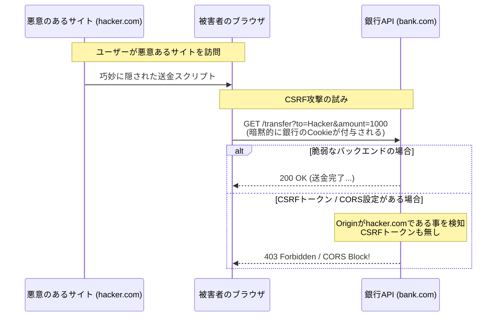

# 13.3.2: Web Security & OWASP

### 1. 【エンジニアの定義】Professional Definition

> **81. OWASP Top 10**:
> The Open Web Application Security Project が発表する、Webアプリの最も深刻な脆弱性ランキング。「インジェクション」「認証の不備」「暗号化の失敗」などが並ぶ。
> 
> **82. Input Sanitization / 85. XSS (Cross-Site Scripting)**:
> ユーザーが入力した悪意あるスクリプト(``)が、他のユーザーのブラウザ上で実行されてしまうXSS攻撃を防ぐため、特殊文字を安全な形式（エスケープ等）に無害化(Sanitization)すること。
> 
> **83. CSRF (Cross-Site Request Forgery)** / **84. CORS (Cross-Origin Resource Sharing)**:
> 偽サイトからバックグラウンドでリクエストを飛ばさせ、意図しない操作（送金など）を実行させるCSRF攻撃。それを防ぐ仕組みや、別のドメインからのAPI呼び出しを許可/拒否するブラウザ制御がCORS。
> 
> **76. Secrets Management / 78. Encryption / 80. Security Best Practices**:
> パスワードやAPIキーなどの機密（Secrets）はソースコード(Git)に書かず、Key Vaultや環境変数に保存する。データは保存時(at rest)と転送時(in transit: **79. HTTPS**)の両方で暗号化する。最小権限の原則を守る。

---

### 2. 【0ベース・深掘り解説】Gap Filling

#### ⚔️ ハッカーは「入力フォーム」からやってくる
バックエンドエンジニアが最も警戒すべきは「ユーザー入力は全て悪意がある」という前提(**Zero Trust**)に立つことです。
*   **XSS**: 掲示板の名前欄にJavaScriptを仕込み、それを見た管理者のセッションCookieを盗み出します。フレームワーク（Reactなど）が自動エスケープしてくれますが、油断は禁物です。
*   **コマンド/SQLインジェクション**: `admin' OR 1=1 --` のような文字列を入れることで、データベースのチェックをすり抜ける古典的かつ未だに最強の攻撃です。ORM（Django ORMやEntity Framework）やプレースホルダを使うことで防ぎます。

#### 🛡️ Secretsをコードに書くという大罪
GitにAWSのアカウントキーやデータベースへのパスワードを書いて`push`してしまった瞬間、数秒以内にボットがそれを検知して仮想マシンを数千台起動し、翌日に数百万円の請求が来ます（本当に起きます）。
Secrets Management（Azure Key Vault, AWS Secrets Manager, HashiCorp Vault）を使い、動的にキーを取得するアーキテクチャが必須です。

---

### 3. 【通信の視覚化】Visual Guide

CORSエラーとCSRF攻撃のメカニズム比較。

---

### 💡 この用語のまとめ (Key Takeaways)
*   **OWASP Top 10**: バックエンドエンジニアの「交通ルール」。必ず目を通すこと。
*   **XSS / インジェクション**: ユーザーからの入力は全て疑い、検証（Validation）と無害化（Sanitization）を行う。
*   **Secrets Management**: 認証情報やAPIキーは絶対にコードにハードコードせず、Vaultなどの外部シークレットマネージャーから実行時に注入する。
