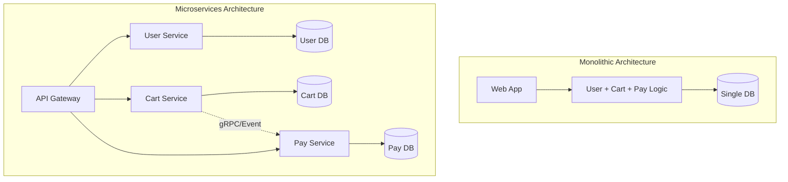

# 13.4.1: System Architecture Patterns

### 1. 【エンジニアの定義】Professional Definition

> **21. Monolith / 20. Microservices**:
> 【モノリス】UI、ビジネスロジック、DBアクセスが1つの巨大なコードベースとプロセスとして動く伝統的なシステム。
> 【マイクロサービス】「決済」「在庫」「ユーザー」など機能ごとにサーバーとDBを分割し、API(gRPCなど)で連携する設計。
> 
> **17. MVC / 18. Layered / 19. Clean Architecture**:
> アプリケーション「内部」のフォルダ分けやコードの責務分離パターン。依存関係を「ドメイン（ビジネスの中核）」に向けて一方向にすることで、変更に強いシステムを作る。
> 
> **22. Serverless / 46. Event-Driven**:
> サーバーのOS管理などをクラウド任せにし、イベント（ファイルアップロード、HTTPリクエスト）をトリガーに関数（AWS Lambda等）を実行する現代の疎結合アーキテクチャ。
>
> **16. Middleware**:
> リクエストがコントローラーに到達する前、またはレスポンスを返す前に処理を挟み込む層。ロギング、認証、CORS設定などを一元管理する。

---

### 2. 【0ベース・深掘り解説】Gap Filling

#### 🏢 モノリスは「悪」ではない
マイクロサービスはバズワードでしたが、スタートアップや中規模プロジェクトで最初から分割するのは**「分散モノリス（複雑なだけの負債）」**になる危険が高く、失敗の典型例です。
最初は「モジュラー・モノリス（1つのシステムだがフォルダ/クラスは綺麗に分離）」で構築し、ビジネスが急成長して組織が分かれるタイミングで、ボトルネック箇所のみをマイクロサービス化して切り出すのが現在最も賢い戦略とされています。

#### 🧅 なぜ Clean Architecture が注目されるのか？
システムで一番大事なのは「フレームワーク（Django, React）」でも「データベース（PostgreSQL）」でもなく、**「ビジネスのルール（カートの計算ロジック等）」**です。
Clean ArchitectureやLayered Architectureは、ビジネスロジックを「中心（Core）」に置き、データベースやWebフレームワークを「外側のプラグイン（いつでも付け替え可能）」として扱います。これにより「DBをMySQLからPostgreSQLに変えても、ビジネスルールのコードは1行も変更しなくて良い」という究極の保守性を実現します。

#### 🔄 Middlewareの力
リクエストごとに毎度「認証チェック」「ログ出力」のコードを書くのは冗長です。Middlewareはパイプラインの途中に立つ関所であり、これを設定するだけで全APIに一括で処理を適用できます。

---

### 3. 【通信の視覚化】Visual Guide

モノリス vs マイクロサービスのアーキテクチャの進化。

---

### 💡 この用語のまとめ (Key Takeaways)
*   **モノリス vs マイクロサービス**: 最初からマイクロサービスに飛びつかず、まずは綺麗なモノリス（モジュラーモノリス）を目指す。
*   **Clean Architecture**: 「ドメイン（ビジネスロジック）」を中心に置き、フレームワークやDBと疎結合にする思想。
*   **Event-Driven / Serverless**: 非同期でスケーラブル。大量処理やスパイク（急なアクセス増）に非常に強い。
