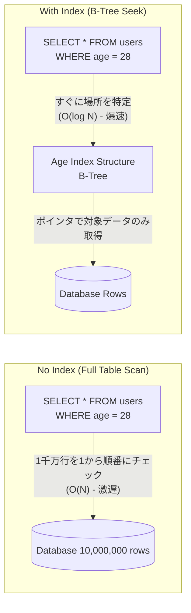

# 13.5.1: Database Core (RDBMS vs NoSQL & Optimization)

### 1. 【エンジニアの定義】Professional Definition

> **29. Database Design / 30. SQL / 31. NoSQL**:
> データの持ち方。「厳格な表形式(RDBMS)」か、「柔軟なドキュメント/KVS(NoSQL)」か。システム要件によって使い分ける（例：決済はSQL、ログやカタログはNoSQL）。
> 
> **32. Indexing / 33. Query Optimization**:
> 【インデックス】本の「索引」と同じ。データを全件走査（フルスキャン）せず、瞬時に該当行を見つけるためのB-Treeなどのデータ構造。
> 【クエリ最適化】オプティマイザが理解しやすいSQLを書く、または実行計画（EXPLAIN）を見てボトルネックを解消するプロセス。
> 
> **34. Transactions / 35. ACID**:
> 【トランザクション】「口座Aからお金を減らし、口座Bに増やす」といった一連の処理の塊。
> 【ACID特性】トランザクションが絶対に守るべき4原則。Atomicity（不可分性）、Consistency（一貫性）、Isolation（独立性）、Durability（永続性）。
> 
> **40. ORM (Object-Relational Mapping)**:
> SQLを直接書かず、PythonやJavaのオブジェクト（クラス）としてデータベースを操作するライブラリ（Hibernate, Entity Frameworkなど）。

---

### 2. 【0ベース・深掘り解説】Gap Filling

#### 🔍 データベースが遅い？ 9割は「インデックス」の欠如
バックエンドAPIのレスポンスが遅い原因の大部分は、データベースへの非効率なアクセスです。
ユーザー名で検索するAPIを作ったとき、数万件のデータだと問題ありませんが、レコードが数千万件になると突然システムが固まります。これは「フルスキャン」が発生しているからです。`CREATE INDEX` を一行実行してキーにインデックスを張るだけで、検索速度が1000倍速くなることも珍しくありません。バックエンドエンジニアに必須のチューニングスキルです。

#### ⚖️ ORMの光と闇（N+1問題）
ORMはコードを綺麗に保ち、SQLインジェクションを防いでくれる素晴らしいツールです。
しかし、「投稿一覧と、それぞれに関連するコメント」を取得しようとした時、裏側で「投稿を取得するSQL（1回） + 各投稿のコメントを取得するSQL（N回）」という合計 N+1 回のクエリが発行されてしまい、DBをパンクさせる**N+1問題**が頻発します。ORMに頼りきりにならず、裏でどんなSQLが発行されているか（Eager Loadingの使用等）を意識する必要があります。

#### 💳 ACID特性は銀行の命
トランザクション中にサーバーの電源が落ちても、「口座Aからお金は減ったが、口座Bに入金されていない」という中途半端な状態(**A**tomicity違反)になってはいけません（必ず全成功か、全ロールバックになる）。RDBMS（MySQL, PostgreSQL）はこれを強固に守るため、基幹システムに採用されます。

---

### 3. 【通信の視覚化】Visual Guide

インデックスを使わないフルスキャン vs インデックス検索の挙動比較。

---

### 💡 この用語のまとめ (Key Takeaways)
*   **SQL vs NoSQL**: データの「関係性と厳格さ」が重要ならSQL。「拡張性と柔軟性」ならNoSQL（MongoDB等）。
*   **Indexing**: パフォーマンス改善の銀の弾丸。ただし無闇に張ると書き込み（INSERT/UPDATE）が遅くなるためトレードオフ。
*   **ACID**: 一貫性を保証するRDBMSの魂。
*   **ORMとN+1問題**: 便利なORMだが、裏側で発行されるクエリ数を常に警戒すること。
