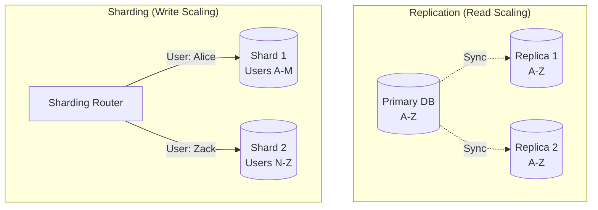

# 13.5.2: Distributed Data (CAP, Sharding)

### 1. 【エンジニアの定義】Professional Definition

> **36. CAP Theorem (CAP定理)**:
> 分散システムにおいては、「Consistency（一貫性）」「Availability（可用性）」「Partition tolerance（分断耐性）」の3つのうち、最大でも2つしか同時に満たすことができないという定理。
> 
> **37. Replication**:
> データベースを複数のサーバー（ノード）に複製すること。メインノード（Primary/Master）が倒れても、複製（Secondary/Replica）が引き継ぐことで可用性が高まる。
> 
> **38. Sharding**:
> 1つの巨大なデータベースを、何らかのキー（例：ユーザーIDのハッシュ値）に基づいて水平に分割（シャーディング）し、複数の別々のサーバーに配置すること。書き込み性能をスケールさせる奥義。
> 
> **39. Connection Pooling**:
> アプリからDBへの接続（コネクション）を毎回確立・切断するのではなく、プール（プールに溜めておく）して再利用する仕組み。

---

### 2. 【0ベース・深掘り解説】Gap Filling

#### 🌍 「CAP定理」に直面する時
システムが世界中からアクセスされる規模になった時、必ずこの定理にぶつかります。
ネットワークが分断された（**P**）時、「最新ではないかもしれないが、とにかく応答を返す（**A**を優先＝NoSQL系に多い）」か、「データに絶対にズレを生じさせないため、安全が確認できるまでエラーを返す（**C**を優先＝RDBMS系に多い）」かの選択を迫られます。

#### ⚔️ Replication（複製）と Sharding（分割）の違い
*   **Replication（レプリケーション）**: データを「丸ごとコピー」します。これは「読み取り（SELECT）」の負荷分散や高可用性（HA）には強いですが、結局どのサーバーにも同じデータを「書き込む（INSERT）」必要があるため、**書き込みの限界は突破できません**。
*   **Sharding（シャーディング）**: データを「分割」します。例えば「A-Mから始まるユーザーはDB1へ」「N-Zから始まるユーザーはDB2へ」というように。これにより、**物理的な書き込み限界を無限にスケールアウト**できますが、運用とクエリ（JOINなど）の難易度が跳ね上がります。

---

### 3. 【通信の視覚化】Visual Guide

レプリケーションとシャーディングの違い。

---

### 💡 この用語のまとめ (Key Takeaways)
*   **CAP定理**: 分散システムでは「完璧」は存在しない。一貫性(C)と可用性(A)のトレードオフを受け入れる。
*   **Replication**: 読み取り速度と障害耐性の向上（コピー）。
*   **Sharding**: 書き込み限界の突破（分割）。最後の手段。
