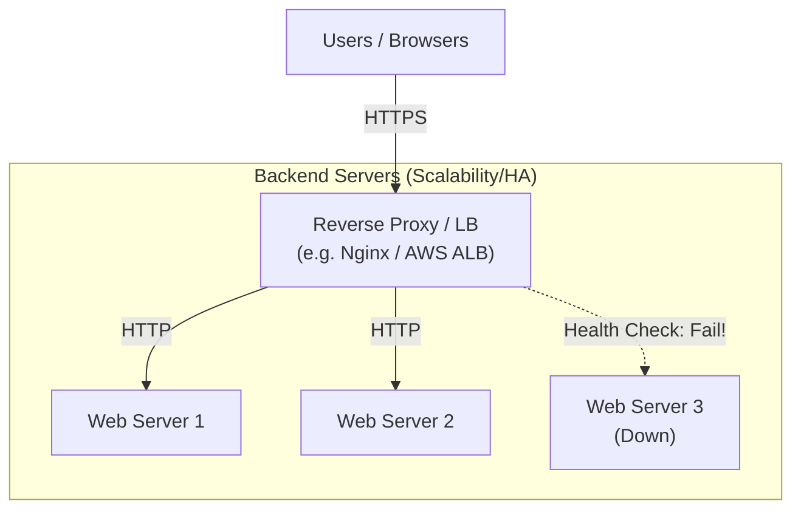

# 13.6.1: Proxies & Load Balancing

### 1. 【エンジニアの定義】Professional Definition

> **23. Load Balancing**:
> 大量のHTTPリクエストを、背後に控える複数のサーバーに均等（または特定のアルゴリズム）に振り分ける技術。
> 
> **96. Scalability / 97. High Availability (HA)**:
> 【スケーラビリティ】負荷増加に対し、サーバー性能を上げる（スケールアップ）か、台数を増やす（スケールアウト）ことで対応できる能力。
> 【高可用性(HA)】システムが停止せずに稼働し続ける（99.99%など）ための冗長化設計。
> 
> **24. Reverse Proxy / 25. Nginx**:
> クライアントからのリクエストを「代理（Proxy）」で受け取り、適切なバックエンドサーバーへ送るサーバー。Nginxはその代表格で、静的ファイルの高速配信やSSL終端（復号）なども担う。
> 
> **51. API Gateway / 52. Service Discovery**:
> 【API Gateway】全APIクライアントからのリクエストを単一の入り口で受け止め、認証やレート制限を行った上で各マイクロサービスにルーティングする巨大なリバースプロキシ。

---

### 2. 【0ベース・深掘り解説】Gap Filling

#### ⚖️ なぜロードバランサーが必要なのか？
1台のサーバーで捌けるアクセス数には限界があります。しかし、「サーバーを2台にする」だけでは、ユーザーはどちらのIPアドレスにアクセスすればいいかわかりません。
ここで前面に立つのが**Load Balancer (LB)** または **Reverse Proxy (Nginxなど)** です。ユーザーはLBのIPだけにアクセスし、LBが裏側のサーバー群（Web1, Web2, Web3...）にリクエストをラウンドロビン（順番）等で振り分けます（= **Scalability**）。1台が壊れても、残りの健常なサーバーにのみ振り分けることでシステムが止まりません（= **High Availability**）。

#### 🚪 API Gateway（次世代の関所）
マイクロサービスアーキテクチャになると、裏側には「ユーザー管理」「商品管理」「決済」など無数の小さなサービスが乱立します。モバイルアプリがそれぞれのサービスのURLを覚えるのは不可能です。
**API Gateway** がそれらを隠蔽し、「入り口は1つ！」と定義します。さらに「この人はログインしているか？」「1秒間に何回APIを叩いているか？」といった共通の関所チェックを全てここで済ませてくれます。

---

### 3. 【通信の視覚化】Visual Guide

リバースプロキシとロードバランシングの基本構成。

---

### 💡 この用語のまとめ (Key Takeaways)
*   **Load Balancing**: 大量トラフィックを捌き、落ちないシステム（HA）を作るための必須技術。
*   **Nginx / Reverse Proxy**: アプリサーバーの手前に立ち、ルーティング、SSL解読、静的ファイル配信を担う盾。
*   **API Gateway**: マイクロサービス時代の統一窓口であり、強力な関所。
