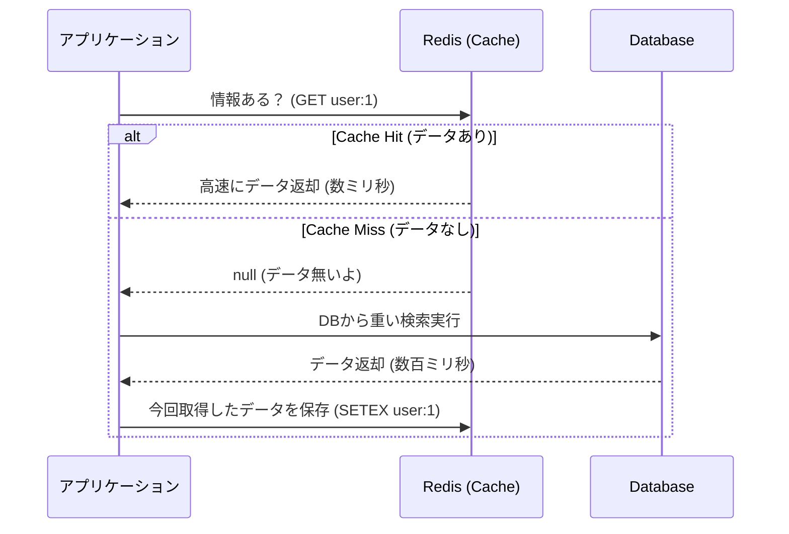

# 13.6.2: Caching Strategies (Redis / Optimization)

### 1. 【エンジニアの定義】Professional Definition

> **26. Caching**:
> データベースや時間のかかるAPIから取得した結果を、次回以降高速に返せるように一時的（メモリ等）に保存しておく仕組み。
> 
> **27. Redis / 28. Memcached**:
> データをハードディスク（遅い）ではなく、メモリ（超高速）に保存する「インメモリ・データストア」。キャッシュ用途として業界標準。
> 
> **86. Data Compression / 89. CDN Integration**:
> 【圧縮】GzipやBrotliなどを用いてレスポンスサイズを縮小すること。
> 【CDN (Content Delivery Network)】画像や動画、JSなどの静的アセットを、ユーザーの地理的な位置に最も近い「エッジサーバー（世界のCDNノード）」にキャッシュし、高速に配信するネットワーク。
> 
> **98. Performance Optimization**:
> キャッシュ、通信圧縮、DBチューニングなどを総合し、レスポンスタイムとシステム負荷を最適化すること。

---

### 2. 【0ベース・深掘り解説】Gap Filling

#### ⚡ キャッシュは「麻薬」であり「諸刃の剣」
「DBのクエリが重い？じゃあRedisにキャッシュしよう」というのは即効性がありますが、**「キャッシュの無効化（Invalidation）」はコンピュータサイエンスにおける最難問の1つ**と言われます。
例えばユーザーがプロフィールを更新したのに、キャッシュ側に古いデータが残っていると「更新ボタンを押したのに名前が変わらない！」というクレームに繋がります（Time-To-Live設定や強制削除ロジックの綿密な設計が必要です）。

#### 🌍 CDN: 世界中を使った巨大なキャッシュ
日本のユーザーが、アメリカのサーバーにある画像を取りに行くと、光の速さの限界で必ず遅延（数百ミリ秒）が発生します。
CDN（CloudflareやAWS CloudFrontなど）を導入すると、システム側が自動的に「日本のエッジサーバー」に画像をキャッシュしてくれるため、次回から日本のユーザーは数ミリ秒で画像をロードできます。

---

### 3. 【通信の視覚化】Visual Guide

リクエストにおけるRedisキャッシュの介在（Cache-Aside パターン）。

---

### 💡 この用語のまとめ (Key Takeaways)
*   **Caching (Redis)**: 反復する重い処理の結果をメモリに置いて爆速化する。ただし無効化（更新）ロジックの設計が肝。
*   **CDN**: 静的ファイルを地球レベルでキャッシュし、ユーザーに最短距離で届ける仕組み。
*   **Performance Optimization**: チューニングは勘ではなく、「計測」してボトルネックを叩くこと。
