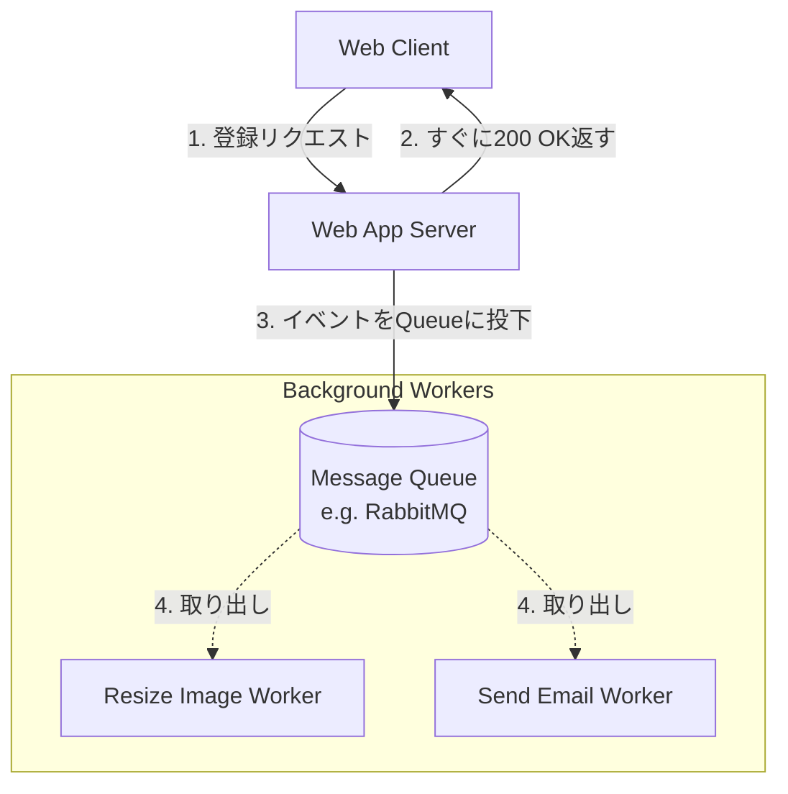

# 13.7.1: Message Queues & Async Processing

### 1. 【エンジニアの定義】Professional Definition

> **44. Message Queues (MQ)**:
> サービスAから送信されたメッセージ（タスク）を一時的に保持する「キュー（待ち行列）」。サービスBは自分のペースでキューからメッセージを取り出して処理する（非同期通信）。代表例：RabbitMQ, SQS。
> 
> **45. Pub/Sub (Publish/Subscribe)**:
> 「配信者（Pub）」が特定のトピックにメッセージを投げると、そのトピックに「登録（Sub）」している複数のシステム全員にメッセージが同時にブロードキャストされるモデル。代表例：Kafka, SNS。
> 
> **47. Background Jobs / 48. Cron Jobs**:
> メインのHTTPレスポンスサイクルから外れ、バックグラウンド（裏側）で非同期に実行される処理。Cron Jobsは「毎日深夜2時」のように時間指定で実行される。
> 
> **87. File Upload Handling / 88. Streaming**:
> 巨大なファイルのアップロードや動画のストリーミングは、同期的に処理するとサーバーのリソースを枯渇させるため、チャンク（分割）化や非同期キューと組み合わせて設計する。

---

### 2. 【0ベース・深掘り解説】Gap Filling

#### ⏳ 「同期」の呪縛から逃れる
ユーザー登録ボタンを押した時、裏で「①DBに保存」「②歓迎メール送信」「③画像のリサイズ」「④CRMへ連携」が行われるとします。これを「同期的（直列）」に行うと、ユーザーは読み込み中のスピナーを何秒も待たされます。
これを解決するのが **Message Queues (非同期処理)** です。ボタンを押した瞬間、①だけ完了させ、②〜④の指示を「キュー」に放り込んで、ユーザーには「完了しました！」と10ミリ秒で画面を返します。裏側（ワーカーサーバー）が自分のペースでキューを拾い、黙々と処理を進めます。

#### 📬 Queue と Pub/Sub の違い
*   **Message Queues (1対1)**: 社内便です。「画像リサイズタスク」がキューに入ると、空いているワーカーが「1人だけ」それを引いて処理します。タスクの確実な分散処理に向いています。
*   **Pub/Sub (1対多)**: テレビ放送です。「ユーザー登録完了」というイベントが発信されると、メール送信システム、分析基盤、ログシステムの全てがそれを同時に受け取り、それぞれ独立して動きます。

---

### 3. 【通信の視覚化】Visual Guide

ユーザー体験を向上させるMessage Queue（非同期ワーカー）のアーキテクチャ。

---

### 💡 この用語のまとめ (Key Takeaways)
*   **Async Processing (非同期処理)**: ユーザーを待たせないための必須アーキテクチャ。時間のかかる処理は全て裏側（バックグラウンド）に回す。
*   **Message Queues**: 仕事のタスクリスト（1人が1つこなす）。
*   **Pub/Sub**: イベントの放送局（全員で一斉に反応する）。
