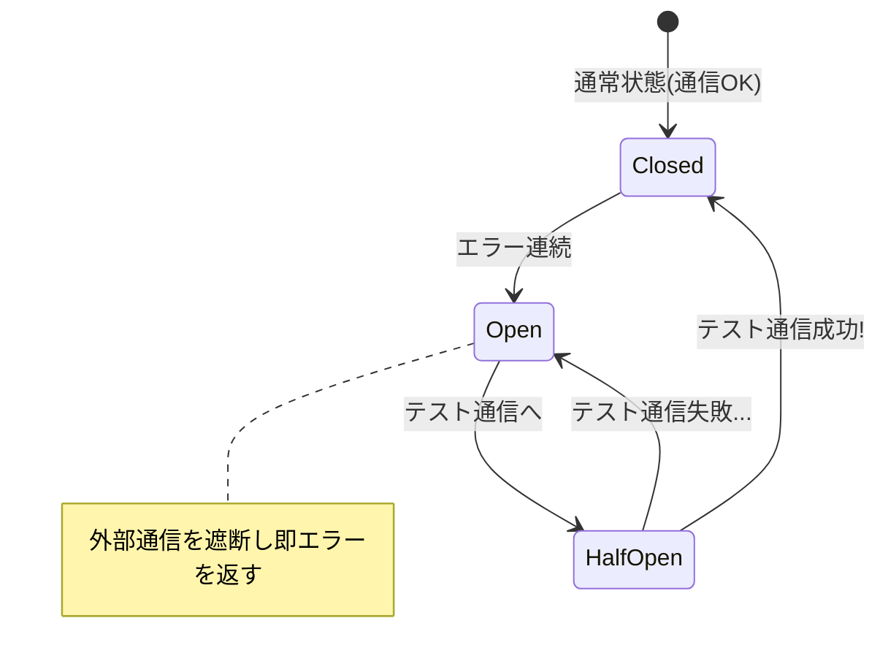

# 13.7.2: Resiliency & Fault Tolerance

### 1. 【エンジニアの定義】Professional Definition

> **56. Fault Tolerance (耐障害性)**:
> システムの一部が故障しても、その影響を全体に波及させず、限られた機能でもシステム全体としては稼働し続ける能力。
> 
> **53. Circuit Breaker (サーキットブレーカー)**:
> 連携先の外部システムがダウン・遅延している際、被害の拡大（タイムアウト待ちによる自サーバーのパンク）を防ぐため、通信を一時的に「遮断（Open）」するデザインパターン。
> 
> **54. Retry Logic / 55. Timeout**:
> 【リトライ】ネットワークの瞬断など一時的なエラーに対し、少し待ってから再試行（バックオフ）するロジック。
> 【タイムアウト】外部通信において「10秒経っても応答がなければ諦める」と見切りをつける必須の設定。
> 
> **49. Rate Limiting / 50. Throttling**:
> 短時間に大量のAPIリクエストが来た際、「1ユーザーあたり1分間に100回まで」等の制限をかけ、システムをDDoS攻撃や過負荷から守る（スロットルする）仕組み。

---

### 2. 【0ベース・深掘り解説】Gap Filling

#### 💥 障害は連鎖する（カスケード障害）
あなたのAPIが「外部の決済API」を利用しているとします。決済APIが重くなり、応答に30秒かかるようになりました。
もしあなたのAPIに「Timeout（タイムアウト）」が未設定だとどうなるか？ クライアントからのリクエストが来たまま30秒間メモリを占有し続け、次々に新しいリクエストが溜まり、あっという間に全メモリを食いつぶして**あなたのサーバーも死にます。** これがカスケード障害です。

#### 🔌 Circuit Breaker（ブレーカーが落ちる仕組み）
家のブレーカーと同じです。決済APIでエラーダウンや異常な遅延が頻発した場合、Circuit Breaker パターンは「今は決済APIが死んでいる」と判断し、回路を開きます（Open）。
これにより、決済APIへの無駄なリクエストを即座に止め、「ただいま決済機能はメンテナンス中です」というエラーを0.1秒で即座に返す（フェイルファスト）ようになります。自サーバーの全滅を防ぐ盾です。

#### 🚦 レート制限（Rate Limiting）の実装
APIを一般公開する場合、いつ誰に悪意のある連続アクセス（またはバグによる無限ループアクセス）をされるか分かりません。API GatewayやNginxレベルでRate Limitを仕掛けることで、自分のDBやインフラを守ります。

---

### 3. 【通信の視覚化】Visual Guide

Circuit Breakerの状態遷移図とカスケード障害の防止。

---

### 💡 この用語のまとめ (Key Takeaways)
*   **Timeout**: 外部通信には「絶対」に設定すること。デフォルトの無限待ち（Infinite）は死の罠。
*   **Circuit Breaker**: ダメなシステムへのアクセスを即座に見切り（フェイルファスト）、自システムの連鎖崩壊を防ぐ。
*   **Rate Limiting**: クラウド時代におけるシステム自衛隊。想定外のトラフィックは入り口で弾く。
