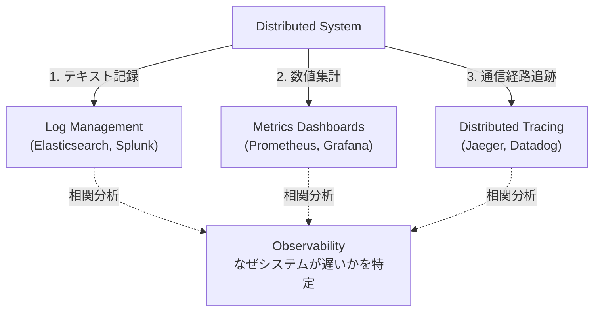

# 13.8.1: Observability & Monitoring

### 1. 【エンジニアの定義】Professional Definition

> **61. Observability (オブザーバビリティ / 可観測性)**:
> システムの外部からの出力（ログ、メトリクス、トレース）だけを見て、システム内部の複雑な状態や障害の根本原因を理解できる度合い。単なる「監視(Monitoring)」をさらに進化させた概念。
> 
> **57. Logging / 59. Metrics / 60. Tracing**:
> 【ログ】「何が起きたか」を記したテキストイベントの記録（例: エラー内容）。
> 【メトリクス】「システムの健康状態」を示す数値データの集計（例: CPU使用率、リクエスト/秒）。
> 【トレース】1つのリクエストが複数のマイクロサービスをまたいで「どこをどう通ったか」の追跡。
> 
> **58. Monitoring / 62. Error Handling / 63. Debugging**:
> メトリクス等を用いた監視と、予期せぬ事象に対する適切なエラー処理（クラッシュの防止）、および原因を見つけて修正するデバッグプロセス。

---

### 2. 【0ベース・深掘り解説】Gap Filling

#### 🔍 Monitoring と Observability の違い
*   **Monitoring（監視）**は「CPU使用率が90%を超えたらアラートを出す」といった、**「既知の問題（Known Unknowns）」**を検知するためのものです。ダッシュボードが赤く光ります。
*   **Observability（可観測性）**は、複雑怪奇なマイクロサービスにおいて、アラートが出た後に「なぜそれが起きたのか？（**未知の問題：Unknown Unknowns**）」を自力で探り当てるための網羅的なデータの備えです。

#### 🧵 分散トレーシング（Tracing）の威力
マイクロサービスアーキテクチャでは、ユーザーの「カート追加」リクエストが裏側で「API Gateway → カートサービス → 在庫サービス → DB」という長旅をします。
この旅の途中でエラーが起きた時、各サーバーのログを別々に見ていても原因は掴めません。**Trace ID**（リクエストごとのユニークな整理券）を発行し、全サービスがログにそのIDを書き込むことで、「リクエストAは在庫サービスで5秒かかった」という壮大なパズルを1枚のグラフとして可視化できます（DatadogやJaegerなどの仕事です）。

---

### 3. 【通信の視覚化】Visual Guide

オブザーバビリティの「3本柱（3 Pillars）」。

---

### 💡 この用語のまとめ (Key Takeaways)
*   **Observability**: 「何が壊れたか(アラート)」だけでなく「なぜ壊れたか」を素早く解明できる設計。
*   **ログ・メトリクス・トレース**: オブザーバビリティを支える三種の神器。
*   **Trace ID**: 分散システムでは、リクエストの旅を追跡するタグ付けが絶対不可欠。
