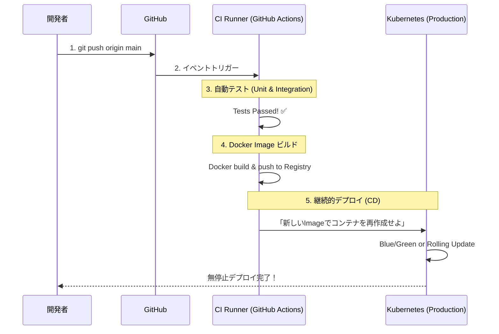

# 13.8.2: DevOps, Containers & Deployment

### 1. 【エンジニアの定義】Professional Definition

> **69. Docker / 71. Containerization**:
> OSレベルでプロセスを隔離する技術（コンテナ）。「私のローカルPCでは動いたのに、本番サーバーでは動かない」という環境依存問題を解決する革命的な標準技術。
> 
> **70. Kubernetes (K8s)**:
> 無数のコンテナを自動で管理（オーケストレーション）するシステム。「サーバーAが落ちたら、自動で別サーバーにコンテナを再起動する」等の自律制御を行う。
> 
> **68. CI/CD (継続的インテグレーション/継続的デプロイ)**:
> 開発者がコードをPush（Git）するたびに、自動でテストを走らせ(CI)、問題なければ本番環境へと自動配置(CD)するパイプライン。
> 
> **64-67. Testing Pyramid**:
> Unit Test（関数レベル）, Integration Test（DB等の連携結合）, End-to-End Test（ブラウザ画面等の全体通し）の階層的テスト戦略。
> 
> **72-75. Deployment Strategies / 77. Environment Variables**:
> Blue-Green（新旧環境を瞬時に切り替え）、Canary（1%のユーザーにだけ新機能公開）などの無停止デプロイ手法や、Feature Flag（機能のON/OFFスイッチ）。環境変数は、DBパスワード等環境で変わる値をコードから分離する。

---

### 2. 【0ベース・深掘り解説】Gap Filling

#### 🐳 なぜDocker（コンテナ化）は世界の標準になったのか？
昔は新しい開発者がチームに入ると、環境構築（Pythonのバージョン合わせ、DBのインストール）だけで最初の3日間が終わっていました。
Dockerなら、設計図（`Dockerfile`）に「Ubuntuの上にPython3.11とこのライブラリを入れる」と書いておくことで、`docker-compose up`を叩くだけで1分で全く同じ環境が構築されます。さらに、それを丸ごと本番サーバーに持っていけるため、**環境のポータビリティ（持ち運び可能性）**が極限まで高まりました。

#### 🚀 CI/CD と Deployment Strategies
月に1回、深夜のメンテナンス画面を出して手動でコードをコピーする時代は終わりました。現代（DevOps）は1日に何十回も無停止でデプロイします。
*   **Blue-Green Deployment**: 「本番用(Blue)」と同じ環境の「待機用(Green)」を用意します。Greenに最新版をデプロイしてテストし、最終的にロードバランサーの向き先をパチッと切り替えるだけで、ダウンタイム0秒で切り替わります。
*   **Environment Variables（環境変数**: 「テスト環境と本番環境でデータベースの向き先やAPIキーが違う問題」を解決するため、絶対にコード内にURLやキーを書かず、DockerやLinuxの「OSの変数」として外から注入させます。

---

### 3. 【通信の視覚化】Visual Guide

モダンなDevOpsの CI/CD デプロイメント・パイプライン。

---

### 💡 この用語のまとめ (Key Takeaways)
*   **Docker**: 「私の環境では動いた」という言い訳を滅ぼした技術。
*   **Kubernetes**: 本番で大量のコンテナを操る指揮者。
*   **CI/CD**: 自動化されたテストとデプロイのベルトコンベア。これが無いとアジャイル開発は回らない。
*   **Environment Variables**: 環境差異や機密情報をコードの外に追い出す鉄則（12 Factor App）。
