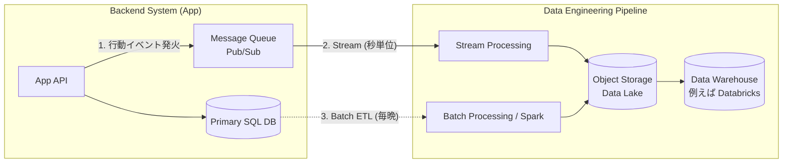

# 13.9.1: Data Engineering (Pipelines & Systems)

### 1. 【エンジニアの定義】Professional Definition

> **92. Data Pipelines / 93. ETL**:
> アプリケーションが出力したデータ等を集め（Extract）、分析しやすいクリーンな形に加工し（Transform）、データウェアハウス等へ保存する（Load）一連の自動化フロー。
> 
> **94. Batch Processing / 95. Stream Processing**:
> 【バッチ】まとまった量のデータを、毎日深夜などに「一括処理」する手法。
> 【ストリーム】システムから生成されたデータ（ログやIoTセンサー）を、やってきた瞬間に「途切れることなく数秒以内で処理」する手法。
> 
> **90. Storage Systems / 91. Object Storage**:
> 【オブジェクトストレージ】階層構造のフォルダ（ファイルシステム）ではなく、フラットな空間に「ユニークなキー」でファイルを保存するスケーラブルなストレージ（AWS S3、Azure Blob Storage等）。安価で容量無限。

---

### 2. 【0ベース・深掘り解説】Gap Filling

#### 🌉 バックエンドエンジニアとデータエンジニアの接点
アプリのバックエンドを作ると、必ず「ユーザーの行動ログを分析に回してほしい」というデータ部隊からの要望が来ます。
バックエンドのデータベース（MySQLなど）に直接分析の重いクエリ（GROUP BYやJOIN）を投げられると、アプリが共倒れしてサービスが停止します。
そこで、**バックエンドがデータを吐き出し（イベント発火）、それをデータ基盤（DWHやデータレイク）へと運ぶ「パイプライン」**の境界線を設計する必要があります。

#### 🌊 なぜ Object Storage が最強なのか？
昔は動画や画像をサーバーの「`/var/www/images/`（ブロックストレージ等）」に保存していました。しかしサーバーが増えると同期が難しくなります。
現代では全て **Object Storage (S3 / Blob)** に放り込みます。API経由でアクセスでき、事実上無制限の容量を持ち、非常に安価です。システムアーキテクチャにおいて、ステート（ファイルや静的アセット）をアプリケーションサーバー自体から切り離し、ステートレスにする（いつでもサーバーを捨て付け可能にする）ための必須パーツです。

---

### 3. 【通信の視覚化】Visual Guide

バックエンド（OLTP）からデータ基盤（OLAP）への典型的なETLとストリームパイプライン。

---

### 💡 この用語のまとめ (Key Takeaways)
*   **ETL / Pipeline**: アプリのデータを分析基盤に安全に渡す「パイプ」。
*   **Batch vs Stream**: 「まとめてドカン（バッチ）」か「来た瞬間にチョロチョロ（ストリーム）」か。
*   **Object Storage**: 全てのデータが行き着く広大な海（データレイクの基盤）。アプリのステートレス化に必須。
